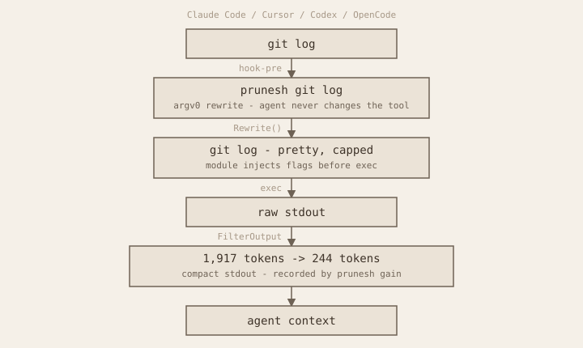

<p align="center">
  <a href="https://prunesh.github.io/prunesh">
    
  </a>
</p>

<p align="center">
  Intercepts shell commands, filters their output, and keeps the context window lean.
</p>

<p align="center">
  <a href="https://prunesh.github.io/prunesh">Website</a> ·
  <a href="https://prunesh.github.io/marketplace">Marketplace</a> ·
  <a href="#quick-start">Quick Start</a> ·
  <a href="#how-it-works">How it works</a> ·
  <a href="#benchmark">Benchmark</a> ·
  <a href="#installation">Installation</a> ·
  <a href="#built-in-modules">Modules</a> ·
  <a href="#commands">Commands</a> ·
  <a href="ROADMAP.md">Roadmap</a>
</p>

<p align="center">
  <a href="LICENSE"></a>
  
  <a href="https://go.dev"></a>
  
</p>

<p align="center">
  
  
  
  
</p>

---

## Why prunesh?

Agents waste tokens on noise: full `git log` histories, verbose `find` trees, progress bars, comment-heavy files. That noise fills the context window and drives up cost.

| Without prunesh | With prunesh |
|---|---|
| `git log` dumps 80 commits verbatim | Compact: 80 commits → 244 tokens (−87%) |
| `find` returns 150 raw paths | Grouped by directory, capped, extension summary |
| `Read` includes every inline comment | Comment lines stripped; structure preserved |
| Savings are invisible | Recorded and queryable with `prunesh gain` |

prunesh does not parse semantics. It applies deterministic, heuristic rules: truncation, grouping, extension summaries, comment stripping.

## Quick Start

```bash
# 1. Install
curl -sSL https://raw.githubusercontent.com/prunesh/prunesh/main/install.sh | sh

# 2. Activate in a project
cd your-project
prunesh init

# 3. Install the Claude Code plugin
claude plugin install -s user prunesh@prunesh

# 4. Check savings
prunesh gain
```

Then restart the agent. Hooks register automatically — prunesh intercepts commands from that session onward.

## How it works

<p align="center">
  
</p>

Two parts:

- **`prunesh` binary** — rewrites commands before they run and filters stdout
- **Per-agent integrations** — register `PreToolUse` / `PostToolUse` hooks and invoke `prunesh`

prunesh activates only in projects with a `.prunesh` marker at the root. Hooks run everywhere but silently pass through any project without it.

## Benchmark

Numbers from `go test ./internal/hook/... -v`. Token estimate: ~4 chars/token.

| Input | Before | After | Savings |
|---|---:|---:|---:|
| `find`: 150 paths | 1,050 | 374 | **64%** |
| `ls`: 70 entries | 262 | 65 | **75%** |
| `grep`: 250 matches across 20 files | 3,820 | 3,360 | **12%** |
| `git diff`: 400 lines | 3,185 | 813 | **74%** |
| `git log`: 80 commits | 1,917 | 244 | **87%** |
| `Read`: Go file, 100 commented vars | 1,346 | 348 | **74%** |
| `Read`: plain text, 400 lines | 2,772 | 1,380 | **50%** |
| MCP tool response — 5,200 chars | 1,300 | 758 | **42%** |

Savings grow with output size. Small outputs may not be reduced.

## Installation

```bash
curl -sSL https://raw.githubusercontent.com/prunesh/prunesh/main/install.sh | sh
```

Installs the `prunesh` binary and configures hooks for every compatible agent found on the machine.

| Option | Command |
|---|---|
| All agents | `sh -s -- --agent=all` |
| Cursor only | `sh -s -- --agent=cursor` |
| Codex only | `sh -s -- --agent=codex` |
| OpenCode only | `sh -s -- --agent=opencode` |
| From source | `go build -o ~/.local/bin/prunesh ./cmd/prunesh/` |
| Skip binary reinstall | `PRUNESH_SKIP_BINARY=1 sh install.sh -- --agent=all` |

Claude Code uses a plugin instead of the install script:

```bash
claude plugin install -s user prunesh@prunesh
```

Then restart the agent.

## Agent surfaces

| | Claude Code | Cursor | Codex | OpenCode |
|---|---|---|---|---|
| **Hooks** | plugin `PreToolUse` / `PostToolUse` | `~/.cursor/hooks/` | `~/.codex/hooks/` | `~/.config/opencode/plugins/prunesh.ts` |
| **Shell rewrite** | matcher `Bash` | matcher `Shell` | matcher `Bash` + shell aliases | `tool.execute.before` |
| **Read / MCP post** | yes | MCP only | shell rewrite only | `read` and MCP tools |

## Project activation

Run once at the repo root:

```bash
prunesh init
```

Writes a `.prunesh` marker at the git root. Hooks silently skip any project without the marker — prunesh never activates where you did not opt in.

## Built-in modules

All built-in modules ship with the binary.

| Module | Command | What it does |
|---|---|---|
| `find` | `find` | Groups paths by directory, caps shown files, extension summary |
| `ls` | `ls` | Injects `-l` + `LC_ALL=C`; compact to counts and samples |
| `git` | `git` | status/log/diff/branch/show; write subcommands compact on exit 0; push/pull/fetch inject `-q` |
| `grep` / `rg` | `grep`, `rg` | Shared grouping by file with per-file and total caps; `grep` injects `-nH` |
| `cat` / `head` / `tail` | same | Reuses `read.FilterContent` on single-file output |
| `tree` | `tree` | Entry count + capped listing |
| `cargo` | `cargo` | Strips dependency resolution and progress bars from test/build/clippy/check |
| `docker` | `docker` | Filters read-only subcommands (ps, images, inspect); strips layer noise |
| `go` | `go` | Strips verbose output from test/build/vet; passes JSON test output through |
| `npm` / `pnpm` / `npx` | `npm`, `pnpm`, `npx` | Summarizes test runner output; passes through non-test subcommands unchanged |
| `pytest` | `pytest` | Strips PASSED lines; preserves failures and summary |
| `python` / `python3` | `python`, `python3` | Delegates `-m pytest` invocations to the pytest filter |
| `gain` | — | SQLite analytics: recorded on each proxy run |

## Marketplace plugins

Discover and install external plugins from the [prunesh marketplace](https://prunesh.github.io/marketplace).

```bash
# Install latest from the marketplace
prunesh plugin install prunesh/date

# Install a specific version from the marketplace
prunesh plugin install prunesh/date@v0.3.0

# Install directly from a Go module (bypasses the marketplace)
prunesh plugin install github.com/prunesh/prunesh-date@v0.3.0

# Install with replace (when another plugin already handles the same command)
prunesh plugin install prunesh/date --replace

prunesh plugin list
prunesh plugin uninstall prunesh/date
```

| Command | Description |
|---|---|
| `plugin install <id>` | Latest version from the marketplace |
| `plugin install <id@version>` | Pinned version from the marketplace |
| `plugin install <module@version>` | Direct Go module install (requires full path e.g. `github.com/…`) |
| `plugin install … --replace` | Required when another plugin is already active for the same command |
| `plugin list` | List installed plugins; marks the active one per command |
| `plugin uninstall <id>` | Remove by full id (e.g. `prunesh/date`); deletes `~/.prunesh/plugins/<id>/` |

**Conflict policy:** if `acme/date` is active for `date`, installing `prunesh/date` aborts unless you pass `--replace`. With `--replace`, the new plugin becomes active; the previous one stays installed but inactive. To switch back: reinstall with `--replace`.

Uninstalling the active plugin promotes the most recently installed survivor, or falls back to the built-in module when one exists.

### Writing a plugin

External plugins use contract `stdin/v1`: prunesh runs the plugin binary and exchanges JSON on stdin/stdout. Any language works as long as the binary implements the protocol.

To publish a plugin to the marketplace, see the [marketplace README](https://github.com/prunesh/marketplace#publishing-a-plugin).

## Adding a built-in module

1. Create `plugins/mycommand/mycommand.go`
2. Implement the `Module` interface
3. Register at `init()` time
4. Import in `cmd/prunesh/main.go`

```go
package mycommand

import "github.com/prunesh/prunesh/internal/registry"

func init() { registry.Register(&Module{}) }

type Module struct{}

func (m *Module) Name() string { return "mycommand" }
func (m *Module) Rewrite(args []string) ([]string, bool) { return nil, false }
func (m *Module) FilterOutput(args []string, output string, exitCode int) string { return output }
func (m *Module) TokensBefore(output string) int { return registry.EstimateTokens(output) }
func (m *Module) TokensAfter(filtered string) int { return registry.EstimateTokens(filtered) }
```

```go
_ "github.com/prunesh/prunesh/plugins/mycommand"
```

## MCP passthrough

By default, prunesh truncates all `mcp__*` tool responses above 3,000 chars. To exempt specific tools:

```sh
export PRUNESH_MCP_PASSTHROUGH_PATTERNS="my_tool_*,other_tool"
```

Pattern syntax: exact name or glob prefix (`prefix_*`).

## Environment variables

| Variable | Effect |
|---|---|
| `PRUNESH_MCP_PASSTHROUGH_PATTERNS` | Comma-separated MCP tool names or glob prefixes to skip filtering |
| `PRUNESH_NO_UPDATE_CHECK` | Set to any value to disable automatic update notices |

## Commands

```text
prunesh init                             Activate prunesh in the current project (writes .prunesh)
prunesh hook-pre --agent=<agent>         PreToolUse handler — rewrites shell commands to prunesh
prunesh hook-post --agent=<agent>        PostToolUse handler — filters Read and MCP
prunesh json-merge <file>                Deep-merge JSON from stdin into an agent config file
prunesh <module> [args...]               Proxy: run a registered command through prunesh
prunesh mcp-scan                         List MCP server tools, suggest passthrough prefixes
prunesh gain                             Token savings analytics
prunesh plugin install <id>                   Install latest plugin from the marketplace
prunesh plugin install <id@version>           Install pinned version from the marketplace
prunesh plugin install <mod@ver> [--replace]  Install directly from a Go module
prunesh plugin uninstall <id>            Remove an installed plugin by full id
prunesh plugin list                      List installed plugins (active marked)
prunesh update [--check] [--yes]         Check for and install updates
prunesh version                          Print version
```

## Architecture

<p align="center">
  
</p>

Built-in modules and marketplace plugins implement the same `registry.Module` interface. `proxy.Run` prefers an active marketplace plugin from `plugins.db`, otherwise falls back to the built-in registry — same code path either way.

```text
prunesh/
├── cmd/prunesh/              # binary entry point
├── internal/
│   ├── registry/           # Module interface + Register() + EstimateTokens()
│   ├── matchgroup/         # shared grep/rg grouping
│   ├── shell/              # shell command rewrite
│   ├── proxy/              # execute + filter + gain
│   ├── text/               # ANSI strip
│   ├── jsonmerge/          # installer config merge
│   ├── hook/               # PreToolUse and PostToolUse handlers
│   ├── projectmarker/      # .prunesh marker read/write (prunesh init)
│   ├── storage/            # resolves ~/.prunesh data directory
│   ├── updatecheck/        # periodic update detection and notice
│   ├── pluginregistry/     # SQLite DB for installed plugins
│   ├── pluginsubprocess/   # stdin/v1 protocol adapter
│   ├── plugininstall/      # download, validate, install plugin binaries
│   └── pluginmanifest/     # prunesh.json manifest parsing and validation
├── plugins/                # built-in modules (compiled into the binary)
└── integrations/
    ├── claude/             # Claude Code plugin (hooks + scripts)
    ├── cursor/             # Cursor hook scripts
    ├── codex/              # Codex hook scripts
    └── opencode/           # OpenCode plugin
```

The `registry` package is the only shared dependency between modules. Modules never import each other.

## Design principles

- **Deterministic** — same input always produces the same output; no model calls, no caching
- **Opt-in by project** — global hooks are inert without `.prunesh`
- **Heuristic, not semantic** — truncation and grouping rules, not intelligent compression
- **Measurable** — `prunesh gain` shows exactly what was saved and why

## Known issues

### Codex: PreToolUse hook shows "New hook — review required"

When the `PreToolUse` hook is added to `~/.codex/hooks.json` for the first time, Codex CLI requires an explicit trust review before running it. This is expected — it is a security feature of Codex.

**Fix:** start a Codex session normally. When the review prompt appears, approve the hook (press `a`). Codex writes the hash to `config.toml` and the hook runs on all subsequent sessions without interruption.

## License

[Apache 2.0](LICENSE): use, modify and distribute freely; retain the copyright notice and include attribution on redistribution.
